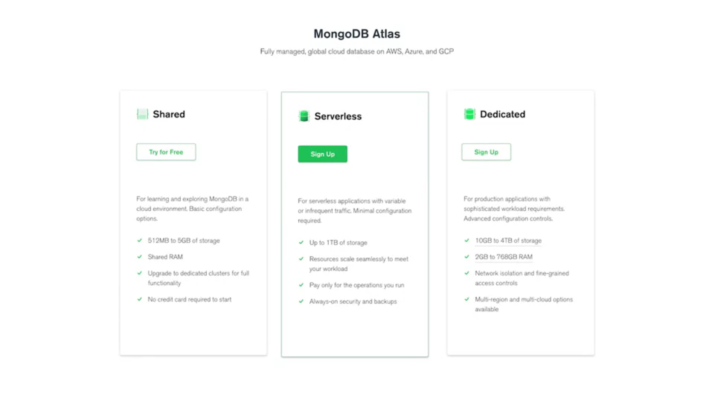
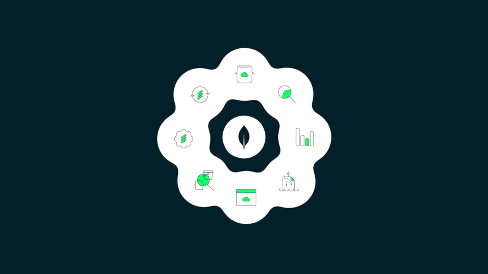

# **Introduction to the MongoDB Atlas : The Developer Data Platform**

Atlases are comprehensive developer data platform. 

At its core is Atlas database. Our database has a service. This means that when you are using Atlas, you don't need to manage MongoDB yourself. Instead, Atlas will manage the database for you and handle all of the lifecycle details behind the scenes. 

When using Atlas, your database deployments have built-in replication, or what MongoDB refers to as a replica set. This means that your data is stored on more than one server, which is a core tenet of MongoDB. This ensures both data redundancy and that your data will be available in the event of a server failure. 

In Atlas, there are two types of database deployments,

1. Serverless instances and 
2. Clusters. 

## **Serverless**
A serverless instance scales on-demand and only charges you for the resources that you use. 

Serverless instances are great option for applications with highly variable or sparse workloads over time. This is a much simpler choice if you don't know what hardware you need or if you just want to use a serverless architecture in general. 

## **Cluster**
A cluster is several MongoDB servers working together. There are two cluster options, 

1. Shared and 
2. Dedicated. 

## **Shared Clusters** 

Shared clusters are smaller and include a free tier option, which is a great way to get started with Atlas. It has over 100,000 new deployments per month. Rest assured that if you choose this option, you can run your small projects on it indefinitely. 

## **Dedicated Clusters** 

Dedicated clusters are larger dedicated resources and can be customized to your specific needs. There are options for both low and high traffic applications that have cluster auto-scaling enabled by default, as well as enhanced security features. This is the preferred choice for production workloads. 

When deploying your cluster on Atlas, you can choose from a number of cloud providers, including AWS, Google Cloud, and Microsoft Azure, in over 100 geographic regions. You can deploy globally across multiple regions or even multiple clouds. As your needs change so can your cluster. You always have the option to change your scaling tier, region or cloud provider. Atlas will make these changes for you without any downtime. 

Atlas includes 

1. Operational insights and back ups with point in time restore. 

2. It also has capabilities useful for later stages of the lifecycle, like built-in data tiering with online archive.  

3. You can also manage everything from the command line using the Atlas CLI or the administration API. 

MongoDB Atlas is more than just a database as a service. It's a comprehensive developer data platform. It provides an integrated suite of products and services that developers can use to build applications faster than ever before. 

## **Atlas Search**

Atlas Search enables you to build rich search experiences on top of your data in the cloud. There's no need for a separate search engine. You can actually access everything from MongoDB's aggregation query interface simply by using the search operator. 

## **Atlas Device Sync**

Atlas Device Sync allows you to keep data in sync between the cloud and mobile or other edge devices. This means that you can deliver rich, always on experiences anywhere. 

## **Atlas Data Lake**

Atlas Data Lake lets you automatically extract data from your Atlas databases to your own low-cost, fully managed data lake environment. Our Data Lake uses a format that's optimized for analytical queries. 

## **Atlas Data Federation**

Atlas Data Federation allows you to seamlessly query, transform, aggregate, and write data from Atlas databases, Atlas Data Lakes, or your own cloud objects storage environments. 

## **Atlas Charts**

Atlas Charts is a built-in data visualization tool. It allows you to easily create, share, and embed rich dashboards built from your own data in the cloud.  

## **Atlas App Services**

Atlas App Services offers a set of capabilities that allow you to build faster. 

1. It includes a Data API which enables you to read and write data in Atlas with standard HTTPS requests. 

2. It also includes a GraphQL API, functions and triggers to enable you to easily create applications with event-driven architectures. 