# **Creating and Deploying an Atlas Cluster**

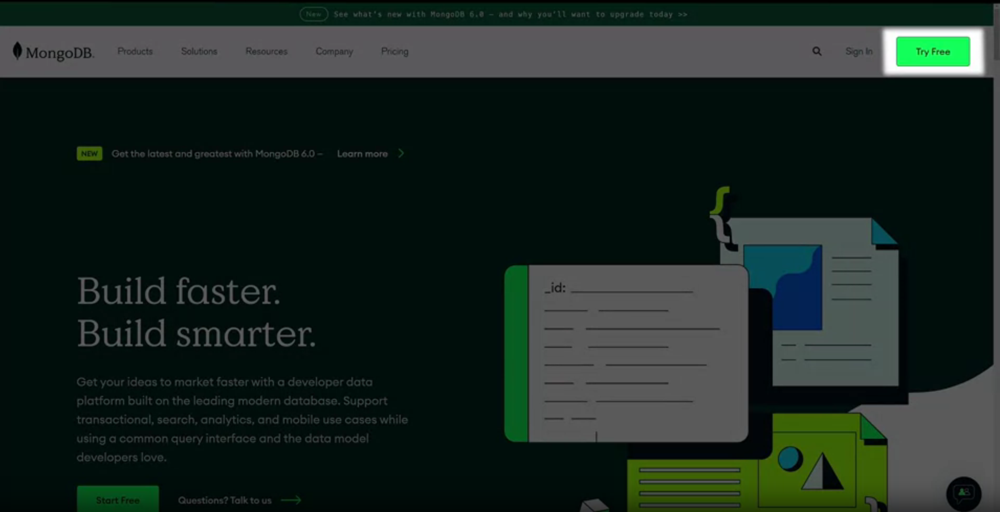

Go to the MongoDB homepage. In the upper right-hand corner, you'll see the try-free button. Go ahead and click on that and it'll bring you to a sign-up page in which you can fill out this form in order to get a new account. 

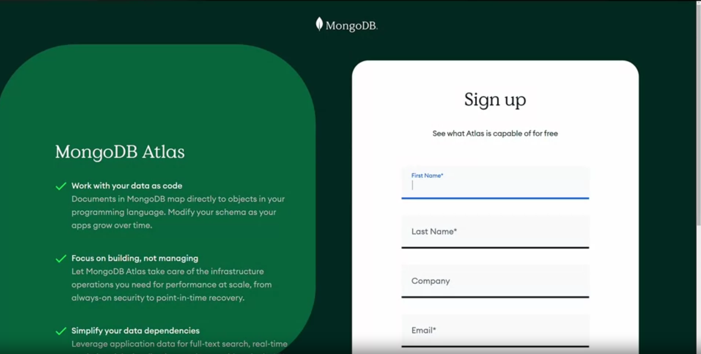

If you have a G-mail at the bottom, you'll also find a sign-up with Google button as well. After you've signed in, you'll be brought to your Atlas dashboard. 

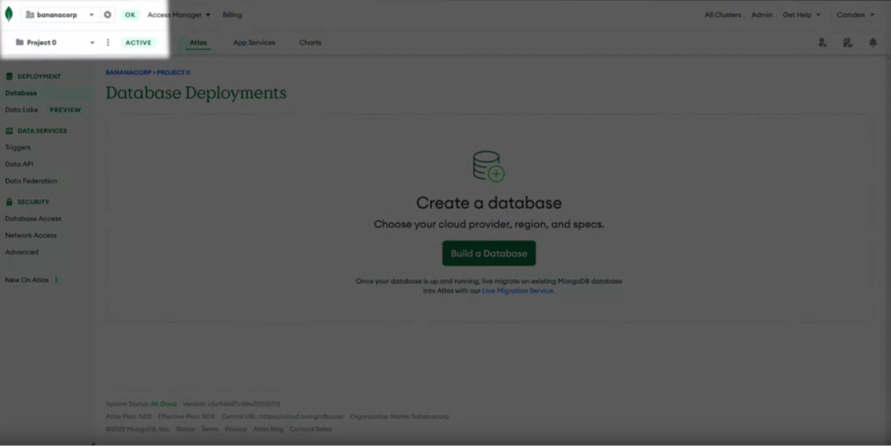

Your first organization will be active in the upper left-hand corner. 

## **Organizations**

Organizations allow you to group and define users and teams and grant them access to projects. 

## **Projects**

Projects allow you to define and organize resources like database clusters. One common way to use this feature is to create separate projects for development, testing, and production environments. 

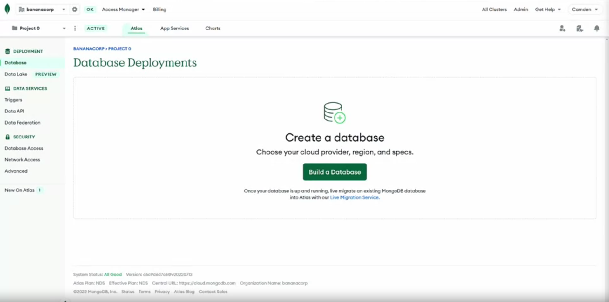

Let's go ahead and create our first Atlas database. To do so, I'll click on the Build a Database button in the middle of the screen. 

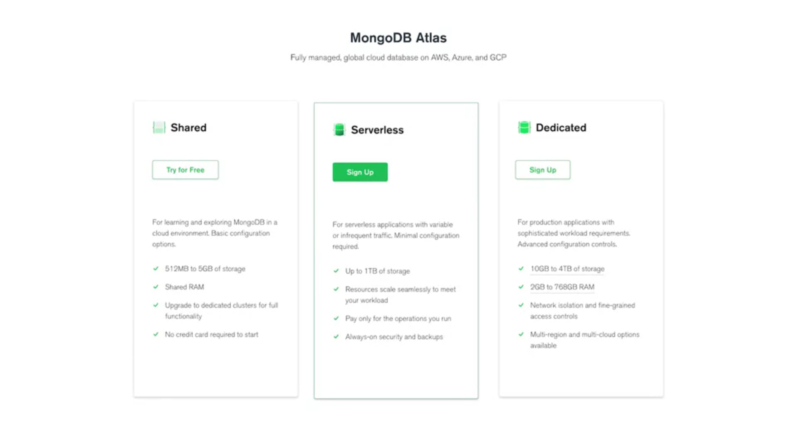

This will bring us to our deployment selection screen. Here, we can see that we have a choice between our serverless, dedicated and shared to your options. Today we're going to be creating a free-tier cluster. We'll go ahead and click on the Create button to move forward.

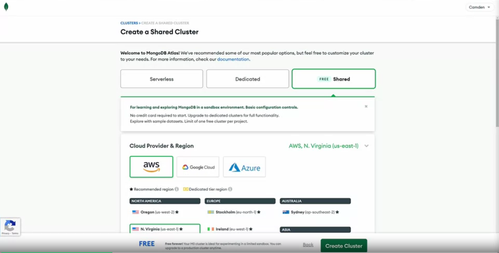

After clicking Create, we'll be brought to the configuration page for our instance. 

First, we'll select the cloud provider and region for our instance. For this particular case, we'll be using AWS, but feel free to use GCP or Azure as your project dictates. Today, I'm in our New York office, so I'm going to go ahead and use the US East region, but feel free to use whichever region is appropriate for you. 

Scrolling further down the page, you can see that there's even more configuration settings. First, let's check out the clusters here. Today, we're going to be using the free tier M0, but if you ever feel that you want to upgrade to one of our paid tiers, you can move to the M2 or M5 quite easily. You can also move to the M10 or higher dedicated here as well. 

Next, let's move to our digital settings. Here, you can see that we can turn on the backup setting for M2 and above clusters. Again, we'll be on M0, so we don't need to worry about turning this on. 

Finally, we can customize the cluster name. For our example today, we'll go ahead and leave the default cluster name of Cluster0 as our selection. From here, we'll go ahead and click on create, Cluster.

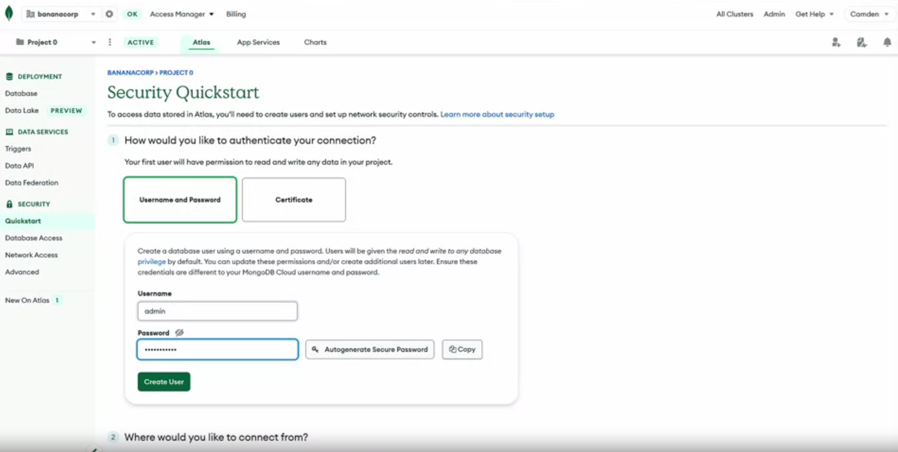

After creating our instance, we'll be brought to the security QuickStart page. 

As a default, MongoDB is created with no users and no IP address that's allowed to access that database outside of the Atlas system itself. 

To get started, we're going to need to create an administrative user, as well as create an access point for our IP address. 

Let's go ahead and start with the administrative user. In the username and password section, I'll go ahead and create an admin and a password. 

After doing so, go ahead and click on Create User to create this new administrative user. As you can see, we've created our new username and authentication type for this user. 

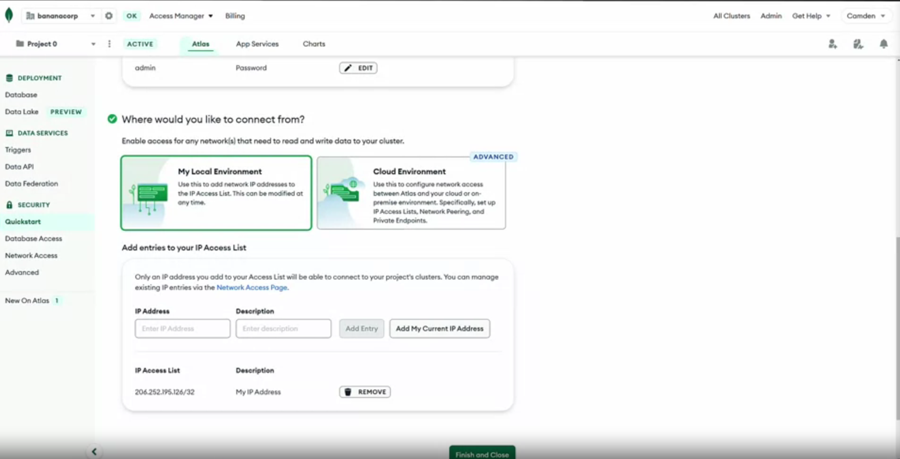
L
et's go ahead and scroll down to the IP address section. 
As I stated previously, MongoDB blocks access from all IP addresses except for Atlas itself. 

In order to be able to work with MongoDB from your local machine, you'll need to put your IP address on the access list. To do so, you can go ahead and click on the Add My Current IP Address button. Additionally, if you want to add other IP addresses, you can use this menu as well. 

After adding your IP address, go ahead and click on, Finish and Close. Go ahead and click on, Go to Databases. 

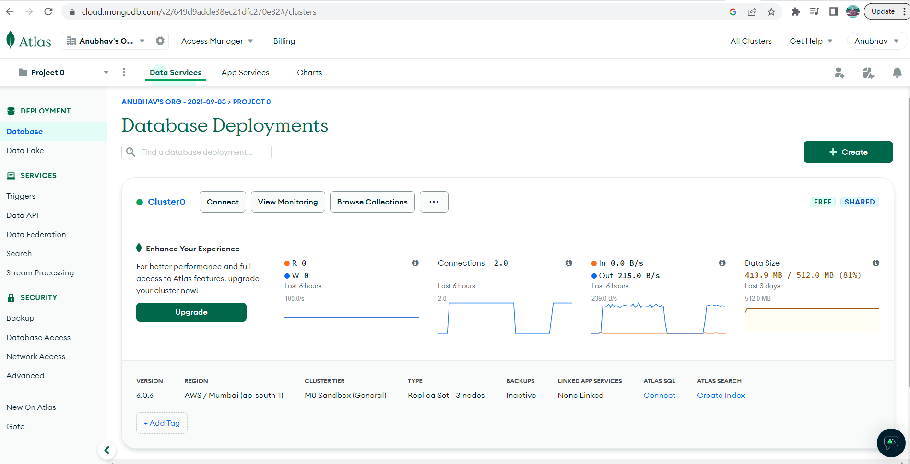

After finishing with your security Quickstart, you'll be brought back to the database deployment screen. 

You'll notice that we don't have data in the database so far. To add new data, we're going to go ahead and load a sample data set. 

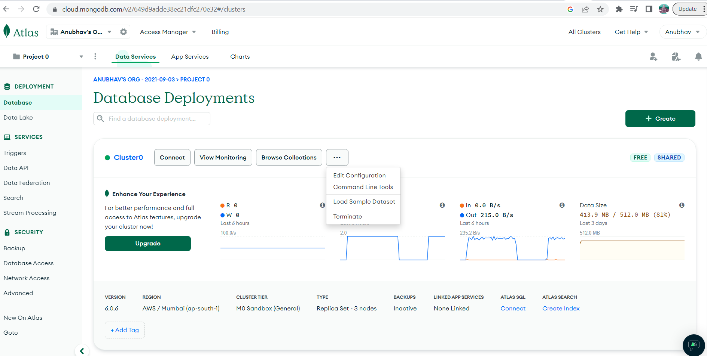

To do so, go ahead and click on the Ellipsis next to browse collections, and then click on, Load Sample Dataset. This will bring up another modal box in which you can also click on Load Sample Dataset.

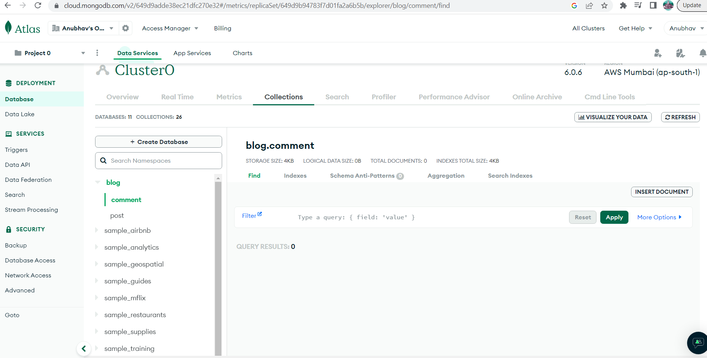

Once Atlas has successfully finished uploading your sample data, you'll be able to view that data in the Data Explorer. To do so, let's go ahead and click on Browse Collections.

This will open Atlas Data Explorer, which will allow you to view, filter, and even modify your data. On the left-hand menu, you'll see a listing of all the databases available within your cluster. For example, we've got the sample_airbnb database as well as the sample_analytics database. Let's go ahead and click on the Sample_analytics database. 
