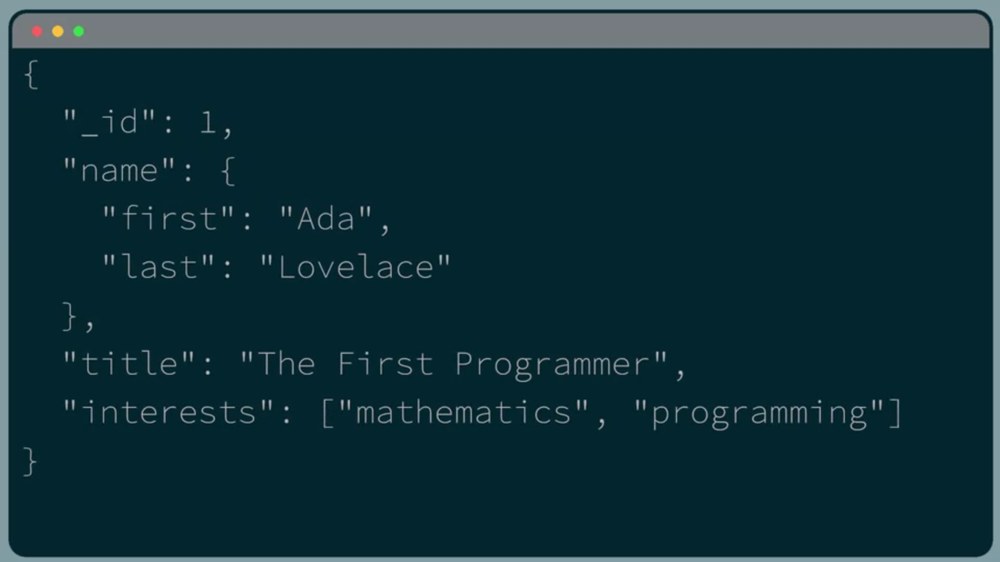

# Introduction to MongoDB

MongoDB is a General Purpose Document Database. 

The MongoDB Database structures data in documents which are similar to JSON objects. This is fundamentally different from how Relational Databases structure data in tables of rows and columns. 

Documents offer a flexible and developer-friendly way to work with your data. 

Documents correspond to objects in code. They match how we think in code, which makes them intuitive to work with. 

The Document Model makes it easier and faster to plan how your application data will correspond to data stored in your database. 

Second, documents can be used to model data of nearly any shape or structure. Documents can model everything from simple Key-value pairs, to Text, Geospatial indexes, Time-series, Graph data, and more. 

The flexibility of documents means that we can use one format to both model and query data for any application. This means development is going to be a lot easier and we can be more productive. 

MongoDB provides drivers in all major programming languages, so it's easy to connect a MongoDB database to our application, no matter what language you're writing in. 

As a general purpose document database, MongoDB has a wide variety of use cases. It's used in everything from small personal and educational projects, to start-ups and missioncritical enterprise applications. Some common examples of use cases for MongoDB include E-commerce, Content management, IoT, time-series data, Trading and Payments, Gaming, Mobile Apps, and Real-time analytics and AI. 

Some of the characteristics that make MongoDB popular across all use cases are its Scalability, Resilience, Speed of development, high levels of data Privacy and Security. 

Here's a few key terms that you're going to need to know when working with MongoDB. 

The first is one we've already mentioned the Document. A document is the basic unit of data in MongoDB. 

A Collection is a grouping of those documents. While documents in a collection are typically similar, they don't have to have the exact same structure because MongoDB has a flexible schema model. 

Last but not least is the Database. In MongoDB, a database is a container for our collections. 

So what's the relationship between MongoDB and Atlas? 

The MongoDB database is at the core of Atlas, which is our developer data platform. The additional functionality that Atlas offers, like full text search and data visualization, are built on top of data stored in a cloud hosted MongoDB database deployment. 