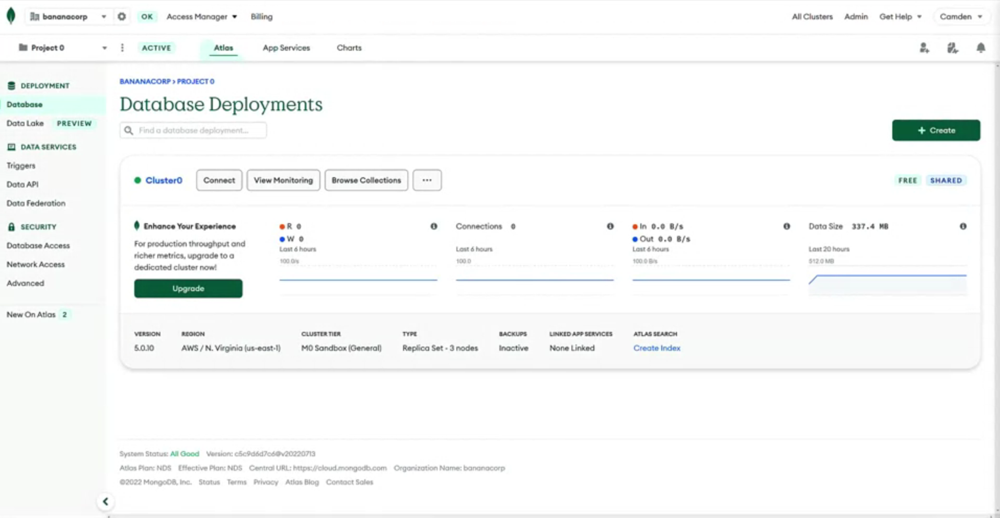
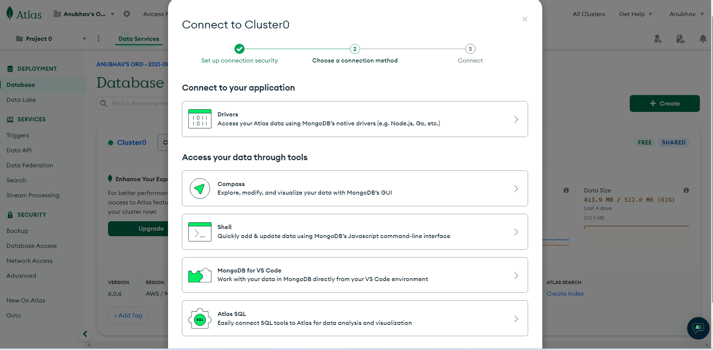
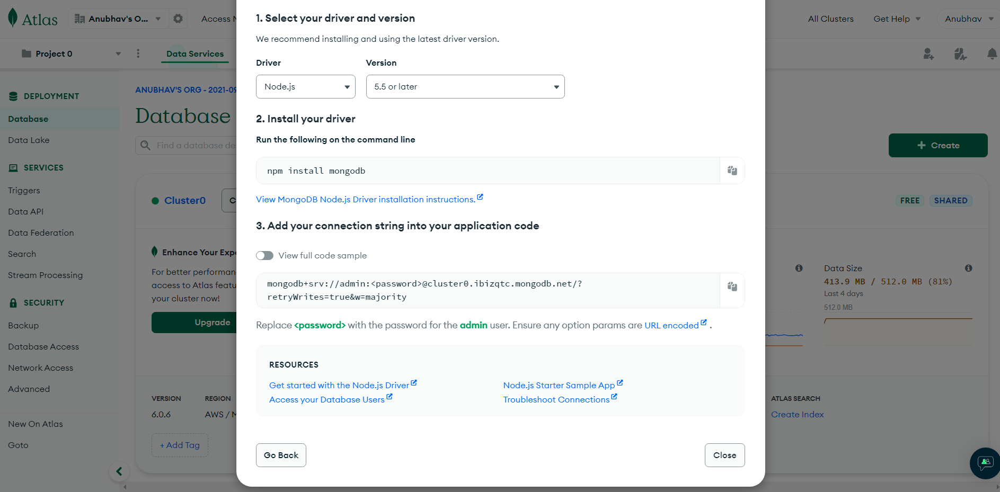

# **Using MongoDB Connection Strings**

The MongoDB connection string allows us to connect to our cluster and work with our data. It describes the host that we'll be using and the options for connecting to a MongoDB database. For example, the connection string can be used to connect from 
1. The Mongo shell, 
2. MongoDB Compass, or 
3. Any other application. 

MongoDB provides two formats for the connection string

## **A Standard Format** 

The standard format is used to connect to standalone clusters, replica sets, or chartered clusters. 

## **A DNS Seed List Format** 

The DNS seed list format was released in MongoDB 3.6. 

1. It allows us to provide a DNS server list to our connection string. 
2. This gives us a lot more flexibility with our deployment, 
3. The ability to change servers in our rotation without reconfiguring any of our clients. 

Before we go into the components that make up the connection string, let's first locate the connection string in our Atlas dashboard. Again, our goal here is to connect to our atlas cluster. 

First, we'll return to our database deployments page. Remember that if you're not on this page already, you can always click on the "Database" button in the left-hand menu to return to this page. To see our connection string, we'll click on the "Connect" button for our cluster 0.

This will bring up a modal box, which gives us options for connecting to this database, through the MongoDB shell, our application, or through MongoDB Compass. Let's go ahead and click on "Drivers" in "Connect your application." 

In the modal box that comes up, you'll find step-by-step instructions for connecting to your MongoDB instance. In the bottom portion of the modal, you'll find the connection string, which we'll use to connect to a MongoDB. 

~~~js
mongodb+srv://admin:<password>@cluster0.ibizqtc.mongodb.net/?retryWrites=true&w=majority
~~~

At first glance, the connection string appears to be a very long string of characters, but we can actually break it down into separate components. 

1. It begins with a required prefix MongoDB that identifies it as a MongoDB connection string. 

2. The connection string from the atlas dashboard uses a DNS seed list entry, which has a list of host behind it that we can connect to. The SRV addition automatically sets the TLS security option to true and tells MongoDB to use the DNS seed list. 

3. Following the MongoDB prefix, there's the username and password that we created for our database in the Atlas dashboard. 

4. Next is the host and the optional port number to our database. If the port number is not specified, MongoDB will default to port 27017. 

5. The final piece of the connection string contains any options that we want to include, such as the connection timeout, TLS, and SSL connection pooling, and read and write concerns. In this connection string, retry writes are set to true. This tells MongoDB drivers to automatically retry when certain types of write operations fail. MongoDB has options for just about anything that you need when it comes to connecting to a database. 

