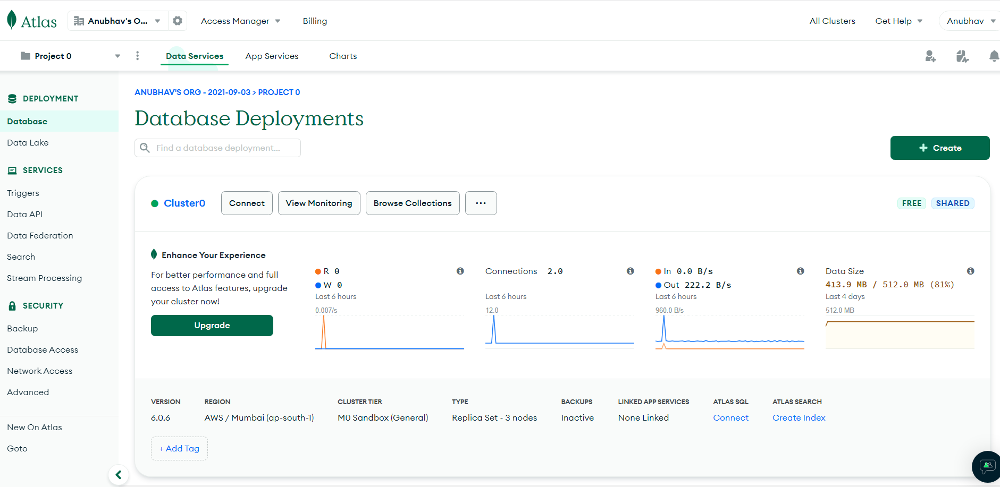
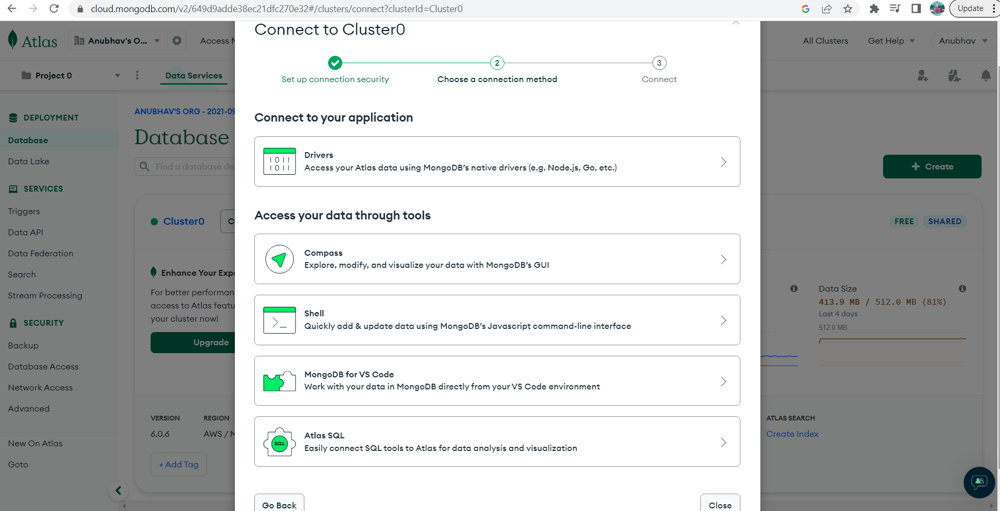
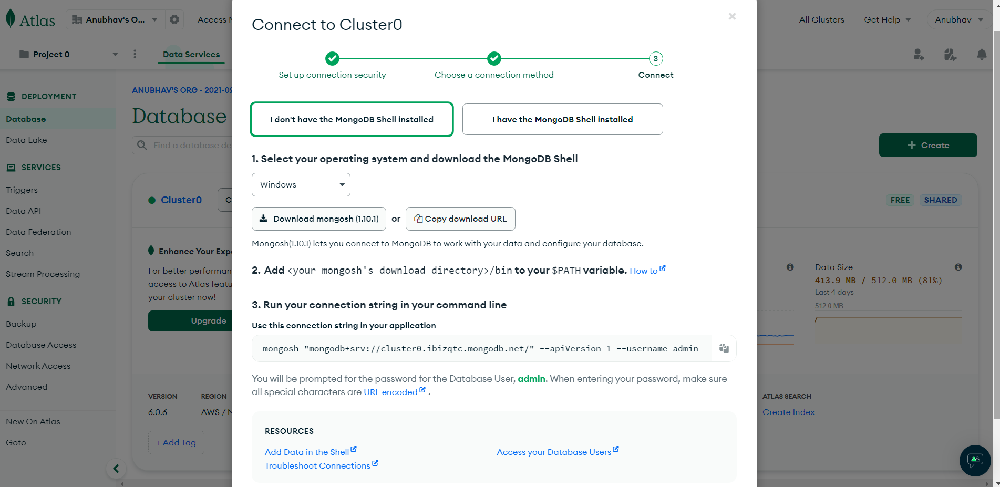
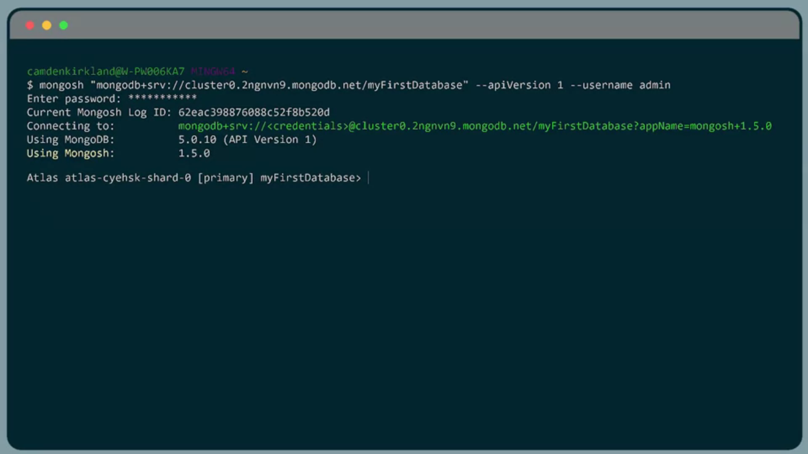

# **Connecting to a MongoDB Atlas Cluster with the Shell**

To get started connecting to the MongoDB Shell, go ahead and log in to your Atlas account. 

Once you've logged in, go ahead and navigate to the database tab. From here, we're going to want to connect to our cluster from our MongoDB Shell. First, go ahead and click on Connect. 

Then select "Shell" Option in "Access your data through tools". 

This will give us step by step instructions for connecting from the MongoDB Shell as well as the connection string. 

I'll go ahead and click on I have MongoDB installed because I do. From there, I'll go ahead and highlight and copy this connection string. Additionally, you can feel free to click the Copy button on the right hand side in order to copy this as well. 

Once I've copied my connection string, we'll go ahead and switch back to our terminal. Let's go ahead and paste our connection string here. And then press Enter. 

This will then prompt me for my admin password. Once I've correctly entered my password, I'll be then connected to my cluster. 

If you get an error about how the Mongosh command isn't found, you've likely not finished installing it on your machine. 

Once you've successfully logged in, you're going to get a prompt with several pieces of information. 

Including the Mongo Shell's log ID, the server that you're connected to, and the versions of MongoDB and the Mongo Shell that you're currently using. 

Now that we've successfully connected to the MongoDB Shell, 

## **MongoDB Shell**

The MongoDB Shell is a Node.js REPL environment. This gives us access to JavaScript variables, functions, conditionals loops, and control flow statements inside of the shell. 