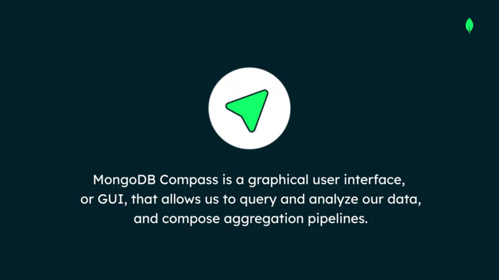
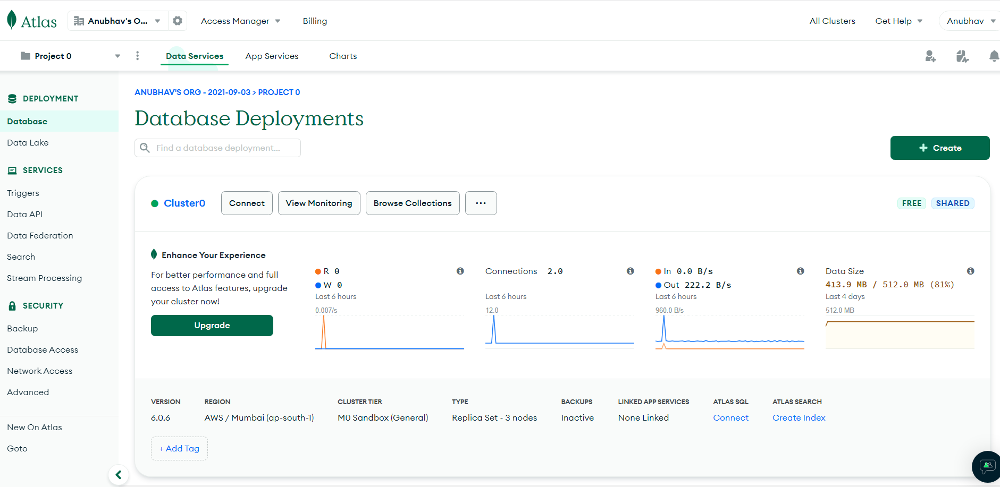
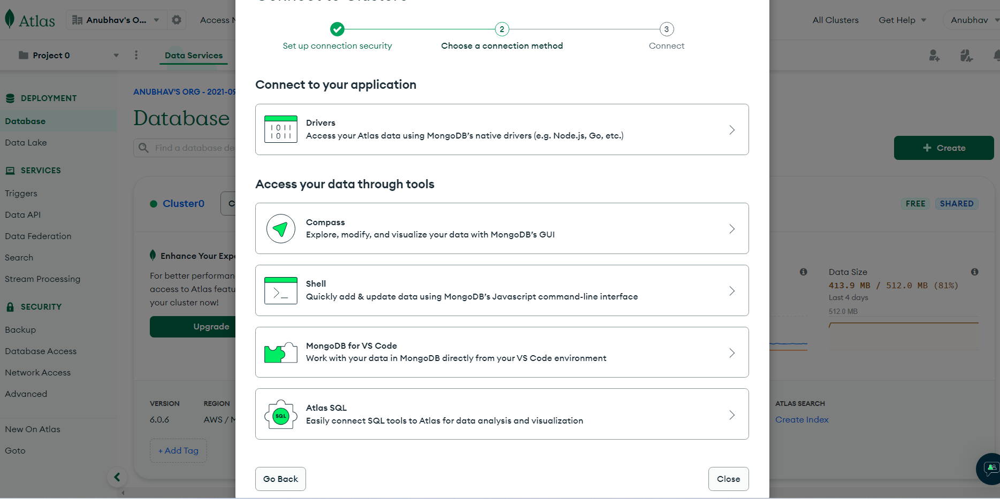
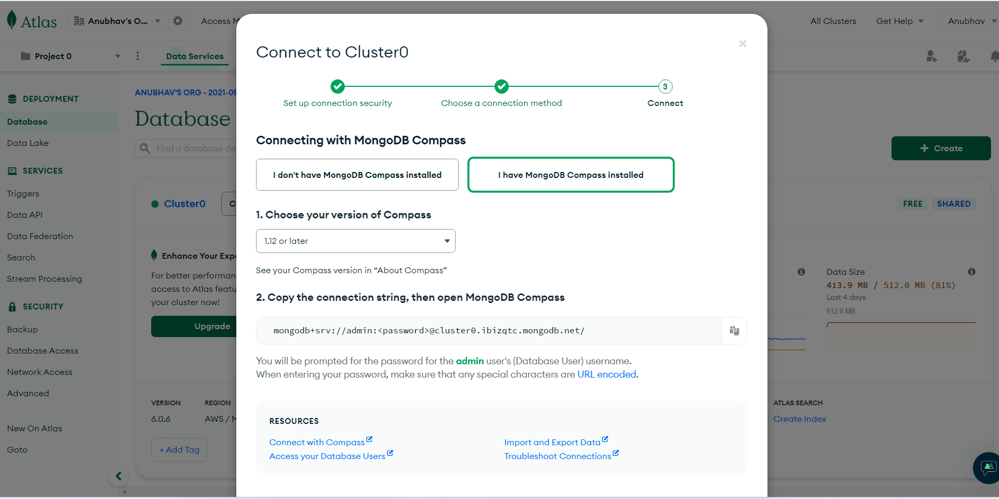
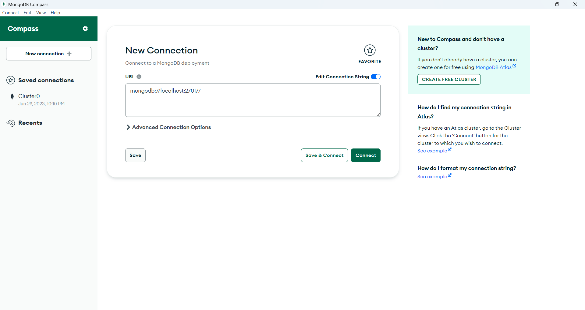

# **Connecting to a MongoDB Atlas Cluster with Compass**

## **MongoDB Compass**

Once your log back into Atlas, we're going to connect to our cluster using another connection string. Go ahead and click on the Connect button next to Cluster0.

This time, on the modal that comes up, we'll go ahead and click on the MongoDB Compass option. 

This will bring up another modal window which will give us a connection string to use with MongoDB Compass. Let's go ahead and copy this.

I'll then go ahead and switch my screen back over to MongoDB Compass. Back in Compass, we'll go ahead and create a new connection. If your window doesn't open to a new connection by default, you can click New Connection in the upper left hand corner. 

On the new connection screen, if your edit connection string is not in the on position, please go ahead and change that to the on position. Now then, in the URI box, we're going to replace what's there with our connection string from Atlas. 

In this connection string, you'll notice that the password isn't filled in just yet. You'll need to replace this password in order to proceed forward.

Once you've updated your password, you can go ahead and save and connect to this cluster.

In the modal box that opens, you'll want to go ahead and name this connection. In my case, I'm going to go ahead and continue to call it Cluster0. You can also choose a color for this connection. 

Once you've named your cluster and selected a color, you can go ahead and save and connect to your cluster. Once you've connected to your cluster, you'll be brought to this view encompass. 

You'll notice the list of databases and their collections on the left hand menu. Additionally, you'll find tabs for my queries so that you can save your aggregations and queries that you write in the future. Another tab for databases which will give you metadata about the databases available in your cluster. And finally the performance tab which will allow you to monitor performance metrics of your cluster. 

## **Connecting to a MongoDB Atlas Cluster from an Application**

[Read Here](https://www.mongodb.com/docs/drivers)