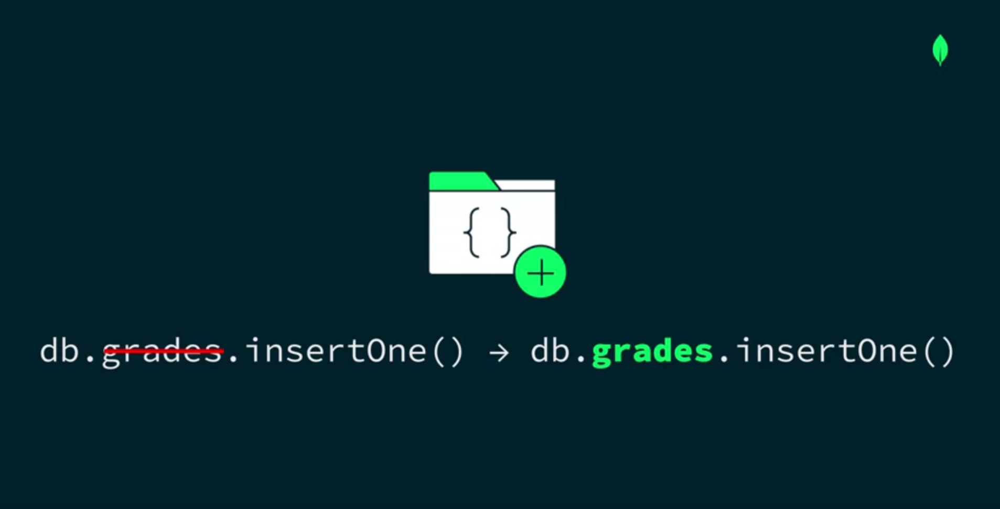

# **Inserting Documents in a MongoDB Collection**
There are two methods that we can use to insert documents into a collection. 
1. insertOne
2. insertMany. 

```insertOne()```

Syntax:

~~~js

db.<collection>.insertOne(<document>);

~~~

e.g.




What if the grades collection doesn't exist in our database yet? MongoDB automatically creates the collection for you when you use insertOne. It's important to remember this when inserting data so you don't accidentally create unnecessary collections in your database. 

Now we pass the document that we want to insert as a parameter inside the insertOne method will run the command. 

~~~js
db.grades.insertOne({
    student_id: 546799,
    scores:
    [
        { type: "quiz", score: 50 },
        { type: "homework", score: 70 } 
    ], 
    class_id: 551 
});
~~~

Output: 

~~~js

{
  acknowledged: true,
  insertedId: ObjectId("649dc74708a06dd90b664155")
}

~~~

The result that's returned confirms that the insertOne statement was successful. 

Note that the inserted id field tells us the _id value of our newly inserted document. 

Every document in a collection must have an _id field and its value must be unique. If you don't provide an _id, like in our example, then MongoDB will automatically generate one for you. 

```insertMany()```

What if we want to insert more than one document at once? MongoDB has a method called insertMany. 


Syntax:

~~~js

db.<collection>.insertMany([
    <document 1>, 
    <document 2>, 
    <document 3>
]);

~~~

We pass in the array of documents we want to insert, each separated by a comma. 

~~~js

db.grades.insertMany([
    { student_id: 777777, scores: [ { type: "quiz", score: 72 } ], class_id: 550 },
    { student_id: 223344, scores: [ { type: "exam", score: 45 } ], class_id: 551 }
]);

~~~

OUtput: 

~~~js
{
  acknowledged: true,
  insertedIds: {
    '0': ObjectId("649dcad208a06dd90b664156"),
    '1': ObjectId("649dcad208a06dd90b664157")
  }
}
~~~
