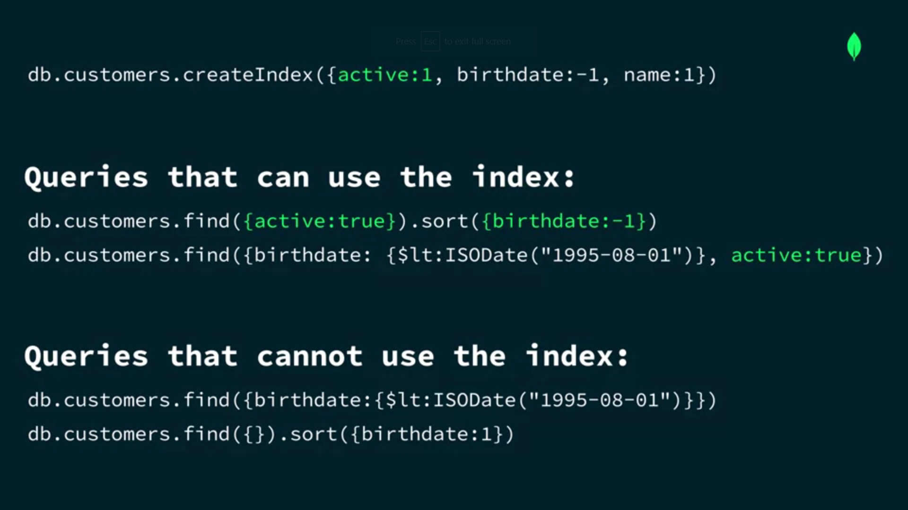
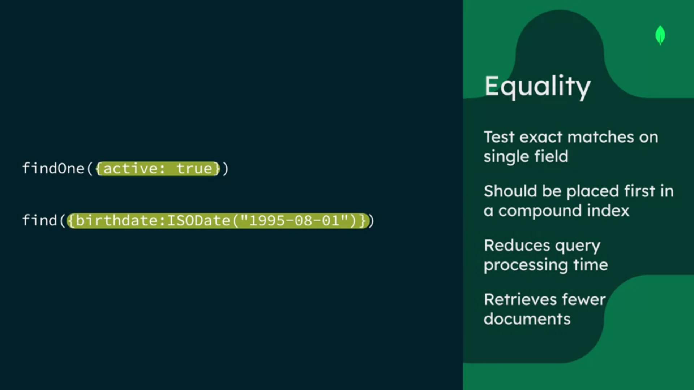
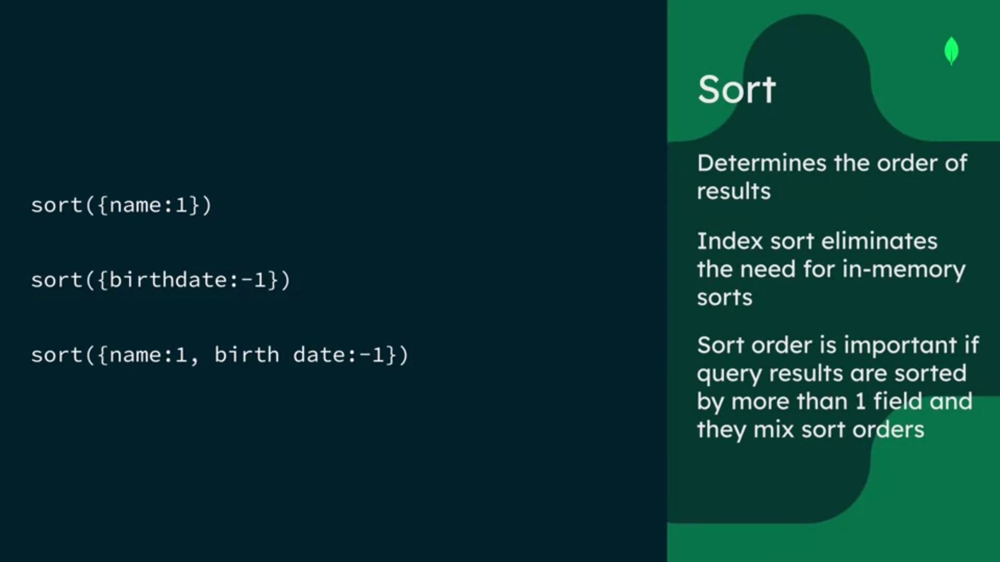
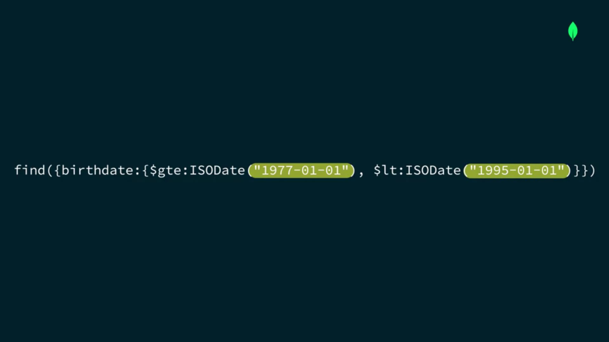

# **Working with Compound Indexes in MongoDB**

1. A compound index is an index on multiple fields. 

2. Compound indexes can also be multi key indexes if they include an array field with the limitation of only one array field per index. 

3. Compound indexes can cover and support queries that match on the prefix of the index fields. 

Any query that contains active or sourced by active can use the index because active is the first field or prefix in the index. 

Queries that do not include the index prefix can't use the index even if they include other fields in it.

This is because indexes are ordered structures. The order of the fields in a compound index matters. 

In general, when we're defining the list of fields and compound indexes, we want fields tested for equality first, followed by fields that are used for sort or range.

Additionally, if we require specific sorted result in our queries, the sort order of the field values in the index also matters to avoid in-memory sorts. 

1. Sort predicates determine the order of results. For instance, we can sort by name and ascending order or by birthday and descending order. 

2. The sort field should be included in the index after the equality fields. This is because once we select a specific value for the first field, the other field values will be in order. 

3. The sort order of these field values in the index is important if the query results are sorted by more than one field, and they mix sort orders. That is, some fields are in ascending order and other fields are in descending order.

Range filters scan fields, as shown in this example, with birth date values between 1977 and 1995. 

Note, in general, we recommend that range and sort should be placed after equality in the index to avoid in-memory sort or filtering. 

